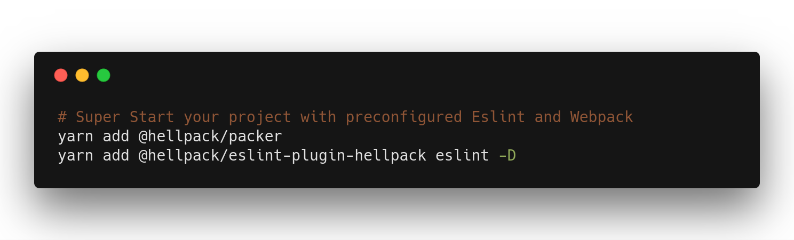

## @hellpack/packer

Preconfigured Webpack for easy setup of Modern Js application.




#### Getting Started

```bash
# Install Dependencies
$ yarn add @hellpack/packer
$ yarn add @hellpack/eslint-config-hellpack eslint -D
```
 Now in your entry file

```js
const polyfill = require('@hellpack/packer/lib/polyfill')

polyfill({ dev: 'path_to_dev_file', prod: 'path_to_prod_file'})
``` 

The `polyfill` function will choose the file according to `NODE_ENV` in environment variables

`NODE_ENV = development` will run the dev file while
`NODE_ENV = production` will run the prod file.

Create your build script

```js
const builder = require('@hellpack/packer');
const config = require('../config');

builder(config).then(_ => console.log('Done')).catch(e => console.log(e));
```

Where the contents of your config file should be

```js
const path = require('path');

const entry = [path.resolve(__dirname, 'path_to_dev_file')];

const output = {
  path: path.resolve(__dirname, 'path_to_prod_dir'),
  filename: 'prod_file_name.js'
};

module.exports = { entry, output }
```
